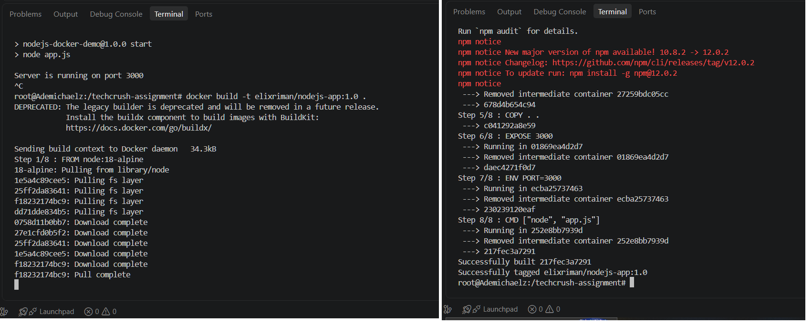
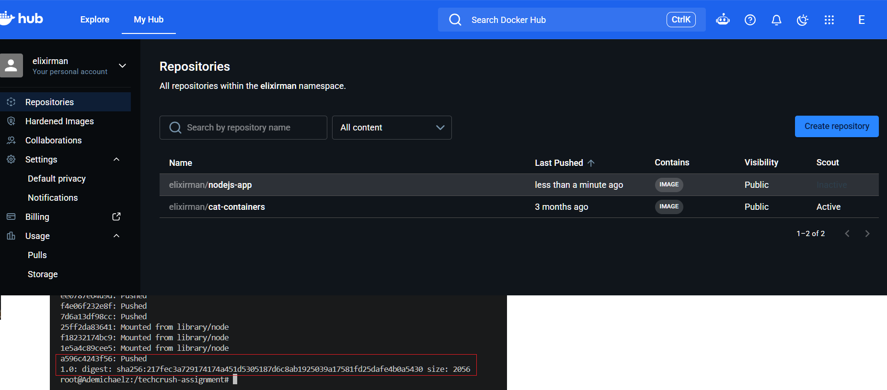
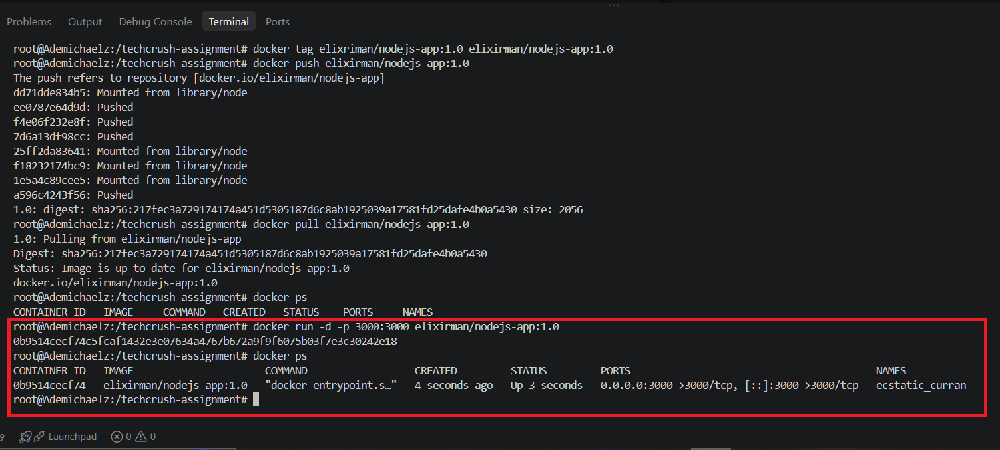
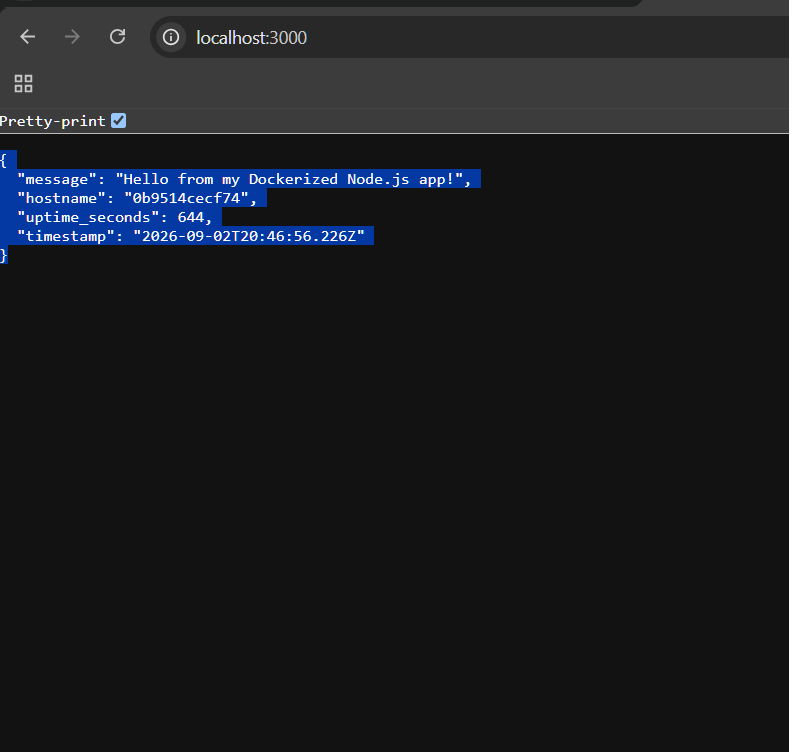

# Node.js Docker Deployment Demo

A simple Node.js (Express) application built and deployed using GitHub, Linux, Docker, and Docker Hub.

## What the app does

| Route         | Description                                  |
|---------------|-----------------------------------------------|
| `/`           | Returns a welcome message, hostname, uptime  |
| `/health`     | Simple health check                          |
| `/api/info`   | Returns app name, version, Node version, OS  |

## Running locally

```bash
npm install
npm start
```

## Building the Docker image

```bash
docker build -t YOUR_DOCKERHUB_USERNAME/nodejs-app:1.0 .
```

**Screenshot:** `screenshots/01-docker-build.png`


## Pushing to Docker Hub

```bash
docker login
docker push YOUR_DOCKERHUB_USERNAME/nodejs-app:1.0
```

**Screenshot:** `screenshots/02-dockerhub-image.png`


## Pulling and running

```bash
docker pull YOUR_DOCKERHUB_USERNAME/nodejs-app:1.0
docker run -d -p 3000:3000 YOUR_DOCKERHUB_USERNAME/nodejs-app:1.0
docker ps
```

**Screenshot:** `screenshots/03-docker-ps.png`

## Live application

**Screenshot:** `screenshots/04-live-app.png`

